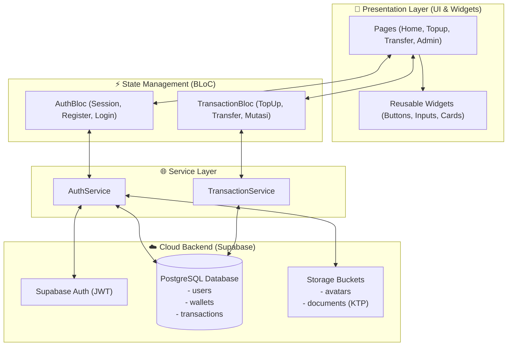

# 💳 Payme — Next-Gen FinTech & Digital E-Wallet Platform

<p align="center">
  
  
  
  
  
</p>

---

## 📌 Ringkasan Proyek (Overview)

**Payme** adalah aplikasi dompet digital (*FinTech & Mobile Banking*) modern yang dibangun menggunakan **Flutter** dengan arsitektur **BLoC (Business Logic Component)** dan didukung oleh database cloud relasional **Supabase (PostgreSQL)**. 

Aplikasi ini mengadopsi standar industri perbankan digital, mencakup verifikasi identitas bertahap (**KYC dengan Upload KTP**), otorisasi transaksi dengan **PIN Keamanan 6-Digit**, penerbitan **Virtual Debit Card 16-Digit**, **Top Up Saldo Multi-Bank**, **Transfer Saldo Antar-Pengguna Real-time**, serta dilengkapi dengan **Web Admin Back-Office** untuk verifikasi dokumen dan audit transaksi finansial.

---

## ✨ Fitur Utama (Core Features)

### 📱 1. Sisi Pengguna (Mobile Client)
- **Onboarding Carousel**: Pengenalan interaktif alur dan manfaat aplikasi.
- **Registrasi Bertahap & KYC (Know Your Customer)**:
  - Input biodata akun (Nama, Email, Password).
  - Pilihan foto profil galeri dan konfigurasi PIN 6-digit.
  - Upload dokumen identitas resmi (KTP/Passport) langsung ke Cloud Storage.
- **Kartu Virtual Cerdas (Virtual Debit Card)**:
  - Generate otomatis nomor kartu 16-digit unik.
  - Tampilan saldo real-time dengan sensor keamanan dan format mata uang Rupiah.
- **Mesin Transaksi Dinamis**:
  - **Top Up Saldo**: Dukungan multi-bank (BCA, BNI, Mandiri, OCBC) dengan custom numeric numpad dan proteksi PIN.
  - **Transfer Uang Real-time**: Pencarian instan sesama pengguna berdasarkan *username*, otentikasi PIN, serta pembaruan saldo otomatis pada kedua belah pihak.
  - **Pembelian Layanan Digital (PPOB)**: Pembelian paket data kuota internet dari berbagai operator seluler.
- **Live Transaction Ledger**:
  - Riwayat transaksi mutasi uang masuk (`+` hijau) dan pengeluaran (`-` merah) yang diperbarui secara otomatis.
- **Session Persistence**:
  - Otentikasi sesi tersimpan otomatis di perangkat pengguna.

### 💻 2. Sisi Operasional (Web Admin Back-Office)
- **KYC Review Panel**:
  - Melihat antrean pengguna yang baru mendaftar.
  - Meninjau dokumen foto KTP secara interaktif.
  - Tombol aksi **[Approve]** (mengaktifkan badge centang hijau verifikasi di HP pengguna) atau **[Reject]**.
- **Financial Audit Trail**:
  - Pemantauan seluruh mutasi transaksi uang secara transparan dan real-time.
- **User & Balance Overview**:
  - Rekap seluruh akun terdaftar beserta nomor kartu virtual dan total saldo beredar.

---

## 🏗️ Arsitektur Sistem (System Architecture)

Aplikasi ini menggunakan prinsip **Clean Architecture & Separation of Concerns**:



---

## 🗄️ Skema Database Relasional (PostgreSQL)

```sql
-- Tabel Pengguna (Users Profile)
users (
  id UUID PRIMARY KEY REFERENCES auth.users,
  name TEXT NOT NULL,
  email TEXT UNIQUE NOT NULL,
  username TEXT UNIQUE NOT NULL,
  pin TEXT NOT NULL,
  profile_picture TEXT,
  ktp_picture TEXT,
  is_verified BOOLEAN DEFAULT FALSE,
  created_at TIMESTAMPTZ DEFAULT NOW()
);

-- Tabel Dompet Digital (Wallets)
wallets (
  id UUID PRIMARY KEY DEFAULT gen_random_uuid(),
  user_id UUID REFERENCES users(id) ON DELETE CASCADE,
  card_number TEXT UNIQUE NOT NULL,
  balance BIGINT DEFAULT 0,
  created_at TIMESTAMPTZ DEFAULT NOW()
);

-- Tabel Transaksi (Transactions)
transactions (
  id UUID PRIMARY KEY DEFAULT gen_random_uuid(),
  user_id UUID REFERENCES users(id) ON DELETE CASCADE,
  transaction_type TEXT NOT NULL, -- 'topup', 'transfer_in', 'transfer_out', 'payment'
  title TEXT NOT NULL,
  amount BIGINT NOT NULL,
  status TEXT DEFAULT 'success',
  created_at TIMESTAMPTZ DEFAULT NOW()
);
```

---

## 📁 Struktur Direktori Proyek

```text
lib/
├── blocs/               # State Management menggunakan flutter_bloc
│   ├── auth/            # BLoC Autentikasi, KYC, dan Sesi Pengguna
│   └── transaction/     # BLoC Top Up, Transfer, dan Riwayat Mutasi
├── models/              # Model Data Entity
│   ├── sign_up_form_model.dart
│   ├── user_model.dart
│   └── transaction_model.dart
├── service/             # Interaksi API & Database Supabase
│   ├── auth_service.dart
│   └── transaction_service.dart
├── shared/              # Design System & Variabel Global
│   ├── theme.dart       # Palet Warna, Typography Google Fonts (Poppins)
│   ├── shared_values.dart # Kredensial URL & Anon Key Supabase
│   └── shared_methods.dart
├── ui/
│   ├── pages/           # Layar Aplikasi Mobile (Home, Transfer, Topup, Auth)
│   │   └── admin/       # Layar Web Admin Dashboard Back-Office
│   └── widgets/         # Komponen UI Modular Reusable
└── main.dart            # Inisialisasi Supabase, MultiBlocProvider, & Routing
```

---

## 🚀 Panduan Memulai (Getting Started)

### Prasyarat
- [Flutter SDK](https://docs.flutter.dev/get-started/install) (versi `>=3.5.3`)
- Akun [Supabase](https://supabase.com) aktif.

### Langkah Instalasi
1. **Clone Repository**:
   ```bash
   git clone https://github.com/arsalcode/payme-app.git
   cd payme-app
   ```

2. **Pasang Dependensi**:
   ```bash
   flutter pub get
   ```

3. **Konfigurasi Supabase**:
   Pastikan kredensial Supabase Anda diatur di file `lib/shared/shared_values.dart`:
   ```dart
   class SharedValues {
     static const String supabaseUrl = 'https://YOUR_PROJECT_ID.supabase.co';
     static const String supabaseAnonKey = 'YOUR_ANON_KEY';
   }
   ```

4. **Jalankan Aplikasi**:
   - Untuk **Aplikasi Mobile (Android/iOS)**:
     ```bash
     flutter run
     ```
   - Untuk **Web Admin / Live Browser**:
     ```bash
     flutter run -d chrome
     ```

---

## 👨‍💻 Pengembang (Author)

- **Muhammad Arsal** — [@arsalcode](https://github.com/arsalcode)
- Project Repository: [https://github.com/arsalcode/payme-app](https://github.com/arsalcode/payme-app)
