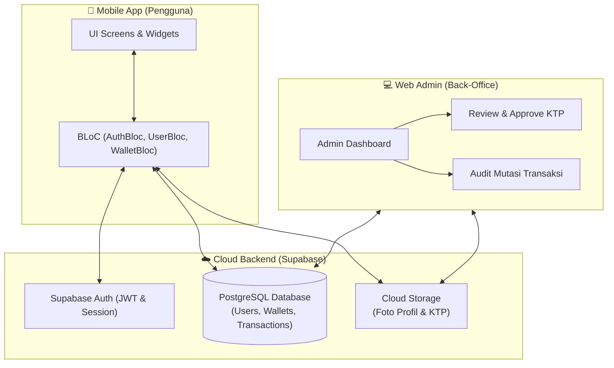
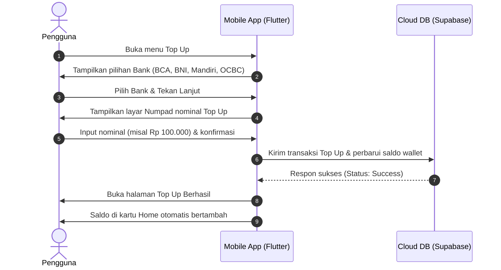
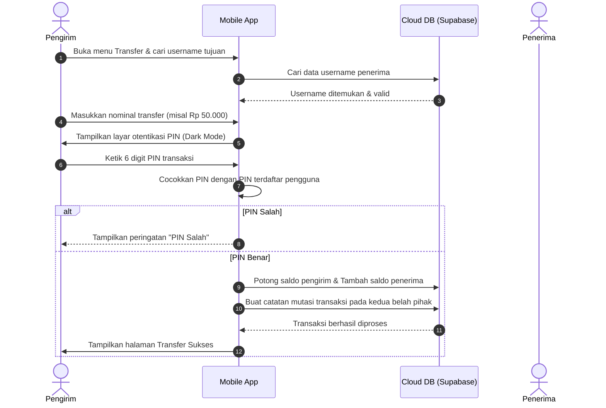

# 🔄 ALUR SISTEM: PAYME FINTECH & E-WALLET

Dokumen ini menjelaskan alur operasional (*system flow & user journey*), arsitektur data, dan mekanisme logika dari aplikasi **Payme**, mencakup sisi **Aplikasi Mobile Pengguna**, **Cloud Database (Supabase)**, dan **Web Admin Back-Office**.

---

## 🏛️ 1. Arsitektur Global Sistem

---

## 🚶‍♂️ 2. Alur Pengguna (User Journeys)

### A. Alur Onboarding & Registrasi Bertahap (Multi-step KYC)
Alur ketika pengguna baru pertama kali memasang aplikasi:

1. **Splash Screen**:
   - Memeriksa apakah terdapat sesi login aktif di perangkat.
   - Jika *ada*: Langsung diarahkan ke **Home Page**.
   - Jika *tidak ada*: Diarahkan ke **Onboarding Page**.
2. **Onboarding Carousel**:
   - Menampilkan 3 kartu ilustrasi pengenalan fitur utama aplikasi.
   - Terdapat tombol aksi menuju **Sign In** atau **Sign Up**.
3. **Pendaftaran Dasar (Step 1 - Account Info)**:
   - Pengguna mengisi: *Full Name*, *Email Address*, dan *Password*.
   - Sistem memvalidasi apakah format email valid dan belum pernah digunakan di database.
4. **Pengaturan Profil & PIN (Step 2 - Security & Profile)**:
   - Pengguna memilih foto profil dari galeri HP (`image_picker`).
   - Pengguna membuat **PIN 6 digit angka** sebagai otorisasi setiap transaksi keuangan.
5. **Verifikasi Identitas KYC (Step 3 - Identity Verification)**:
   - Pengguna mengunggah foto kartu identitas (*KTP / Passport*).
   - Berkas otomatis diunggah ke *Storage Bucket Supabase*.
   - Terdapat opsi **"Skip for Now"** jika pengguna ingin menunda verifikasi.
   - Status verifikasi awal pengguna diset menjadi: `unverified` (atau `pending`).
6. **Registrasi Sukses**:
   - Sistem otomatis membuatkan rekening dompet digital (*Wallet*) dengan saldo awal `Rp 0` dan nomor kartu virtual unik.
   - Pengguna diarahkan ke Dashboard Utama.

---

### B. Alur Dashboard Utama (Home Engine)
Halaman sentral tempat pengguna memantau kondisi finansial:

1. **Header Profil**:
   - Menampilkan salam (*greeting*), nama pengguna, foto profil, dan ikon centang status verifikasi (hijau jika terverifikasi oleh Admin).
2. **Kartu Saldo Virtual (Virtual Debit Card)**:
   - Menampilkan nomor kartu unik (format: `**** **** **** 1280`) dan saldo terkini secara dinamis.
3. **Indikator Level & Reward**:
   - Menghitung persentase akumulasi transaksi pengguna terhadap target reward (misal: Level 1 - target Rp 20.000).
4. **Aksi Cepat (Quick Actions)**:
   - Akses instan menuju: **Top Up**, **Send (Transfer)**, **Withdraw**, dan menu pop-up **More Services** (Paket Data, Listrik, Hiburan, dll).
5. **Latest Transactions (Mutasi Saldo)**:
   - Menampilkan 5 riwayat transaksi terakhir secara real-time (hijau untuk dana masuk `+`, merah untuk pengeluaran `-`).
6. **Send Again (Transfer Kilat Teman)**:
   - Menampilkan kontak teman yang sering ditransfer uang untuk mempercepat transaksi berulang.

---

### C. Alur Transaksi Top Up Saldo
Alur penambahan saldo dompet digital:

---

### D. Alur Transaksi Transfer Uang Antar Pengguna
Alur pemindahan dana antar pengguna dengan proteksi keamanan:

---

### E. Alur Pembelian Layanan Digital (Paket Data Internet)
1. Pengguna memilih menu **Data** pada daftar layanan.
2. Memilih **Provider Seluler** (Telkomsel, Indosat, Singtel, dll).
3. Memilih **Paket Kuota** yang diinginkan beserta harganya.
4. Sistem memvalidasi apakah saldo mencukupi:
   - Jika *tidak cukup*: Menampilkan peringatan saldo tidak memadai dan mengarahkan ke Top Up.
   - Jika *cukup*: Meminta otorisasi PIN ➔ Memotong saldo ➔ Mencatat mutasi keluar ➔ Halaman Sukses.

---

### F. Alur Operasional Web Admin (Back-Office KYC & Audit)
Bagian khusus yang membuktikan profesionalitas portofolio:

1. **Verifikasi Dokumen KYC (KTP/Passport)**:
   - Admin membuka dashboard web.
   - Melihat antrean pengguna yang baru mendaftar beserta foto dokumen KTP yang diunggah.
   - Admin menekan **[Approve]** (Status user berubah menjadi `verified`, lencana centang hijau di aplikasi mobile aktif).
   - Atau **[Reject]** (User mendapat notifikasi untuk mengunggah ulang dokumen valid).
2. **Audit Mutasi Keuangan**:
   - Admin dapat memantau seluruh lalu lintas dana (Top Up, Transfer, Pembelian) secara transparan dan real-time.

---

## 🗄️ 3. Skema Data Relasional (Database Schema)

### Tabel: `users`
| Kolom | Tipe Data | Keterangan |
| :--- | :--- | :--- |
| `id` | `UUID` (Primary Key) | ID unik dari Supabase Auth |
| `name` | `VARCHAR(100)` | Nama lengkap pengguna |
| `email` | `VARCHAR(100)` | Alamat email unik |
| `username` | `VARCHAR(50)` | Username unik untuk pencarian transfer |
| `pin` | `VARCHAR(6)` | PIN transaksi (terenkripsi) |
| `profile_image` | `TEXT` | URL foto profil dari Cloud Storage |
| `ktp_image` | `TEXT` | URL foto KTP dari Cloud Storage |
| `is_verified` | `BOOLEAN` | Status persetujuan KYC oleh admin |
| `created_at` | `TIMESTAMP` | Waktu pendaftaran |

### Tabel: `wallets`
| Kolom | Tipe Data | Keterangan |
| :--- | :--- | :--- |
| `id` | `UUID` (Primary Key) | ID dompet digital |
| `user_id` | `UUID` (Foreign Key) | Relasi ke `users.id` |
| `card_number` | `VARCHAR(16)` | Nomor kartu virtual 16 digit |
| `balance` | `BIGINT` | Saldo uang terkini (dalam satuan Rupiah) |

### Tabel: `transactions`
| Kolom | Tipe Data | Keterangan |
| :--- | :--- | :--- |
| `id` | `UUID` (Primary Key) | ID transaksi unik |
| `user_id` | `UUID` (Foreign Key) | Relasi ke `users.id` pemilik transaksi |
| `type` | `VARCHAR(20)` | `topup`, `transfer_out`, `transfer_in`, `payment` |
| `title` | `VARCHAR(100)` | Judul (misal: "Top Up BCA", "Transfer ke @arip") |
| `amount` | `BIGINT` | Nilai transaksi (Rupiah) |
| `status` | `VARCHAR(20)` | `success`, `pending`, `failed` |
| `created_at` | `TIMESTAMP` | Waktu transaksi |
